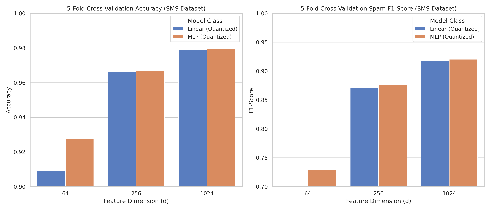
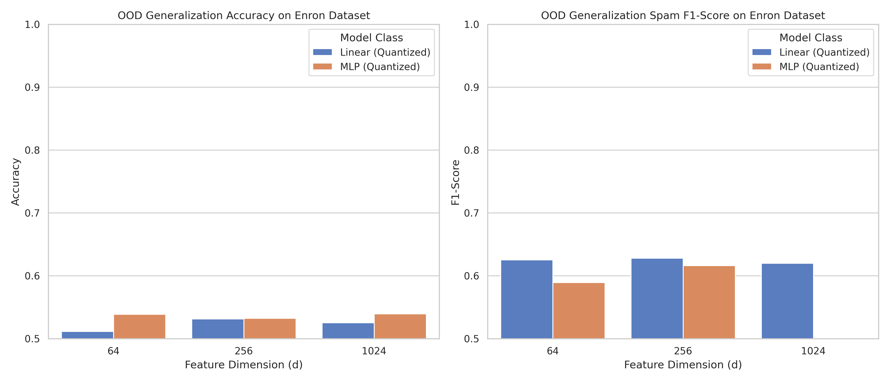
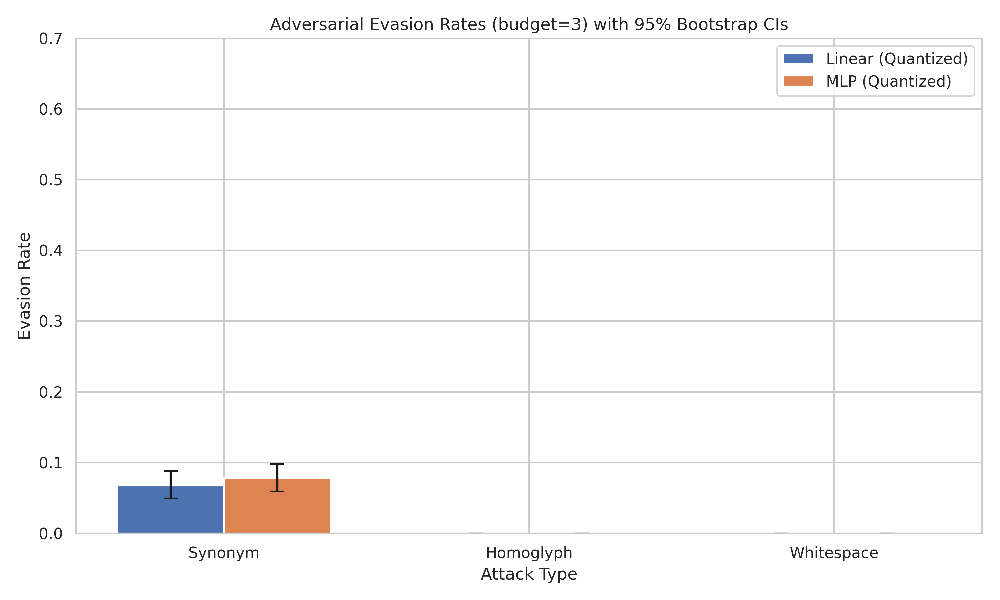
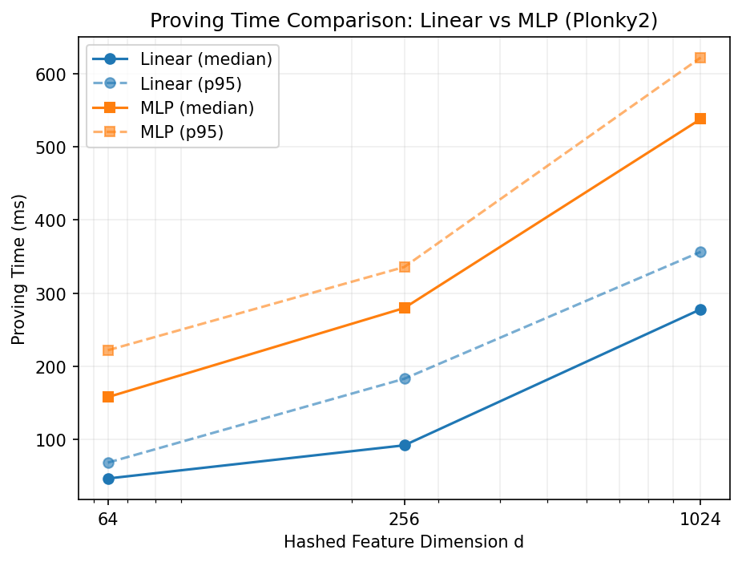
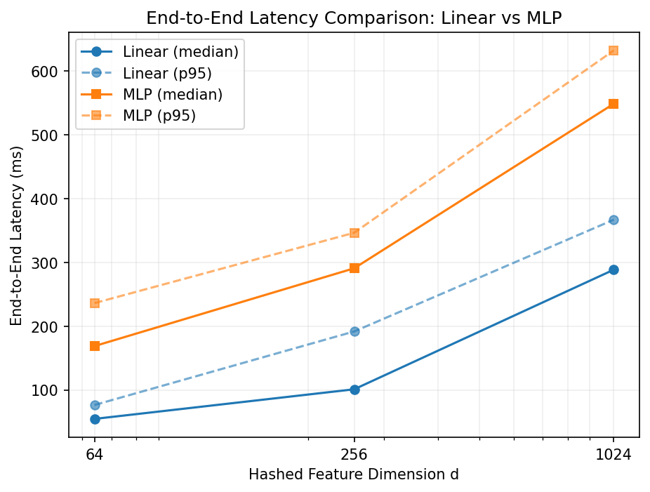
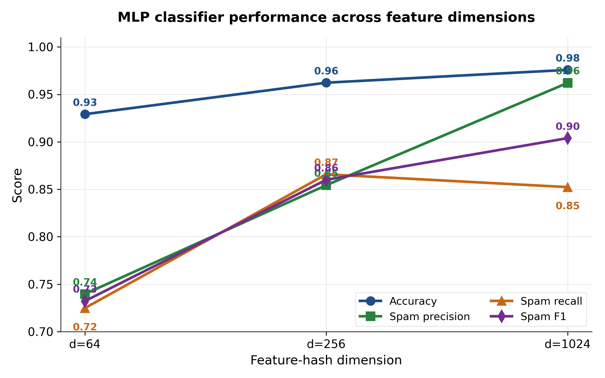
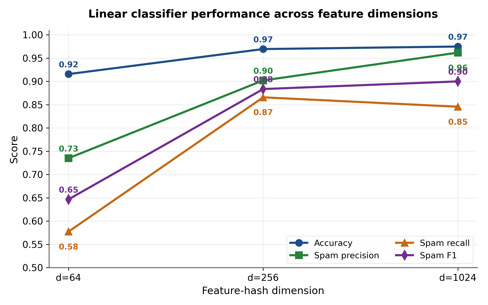

# E2E Messenger & Verifiable Content Moderation Gate

This repository contains the source code and experimental evaluation for a private, verifiable content moderation architecture integrated directly into an End-to-End Encrypted (E2EE) messaging protocol.

---

## 1. Introduction & Academic Overview
In conventional messaging applications, enforcing content moderation policies requires either a centralized server that decrypts and scans messages (compromising user privacy) or pure client-side moderation (which can be easily bypassed or forged by a malicious sender). 

Our design addresses this tension by combining a Signal-style E2EE protocol (X3DH and Double Ratchet) with a client-side zero-knowledge proof (ZKP) circuit built on Plonky2. Before transmitting a message, the sender must run a local machine learning classifier (Linear or MLP) and generate a proof demonstrating that the plaintext complies with the public model's policies. The proof commits to the message via a Poseidon hash, which is bound to the ciphertext as Authenticated Encryption with Associated Data (AEAD) Associated Data (AD). 

The untrusted relay server verifies this ZK proof before routing the message—enforcing compliance without ever learning the message contents. Finally, the receiver performs an attributable binding check to verify that the sender proved compliance for the exact message that was decrypted, preventing payload-forgery attacks.

---

## 2. Cryptographic Architecture & Protocol Data Flow

We integrate and evaluate three protocol layers in sequence to establish a secure, private communication channel with policy enforcement:
1. **Asynchronous Cryptographic Handshake (X3DH)**: Establishes the initial shared secret (`SK`) using a combination of long-term identity keys (IK), signed prekeys (SPK), and one-time prekeys (OPK).
2. **Double Ratchet Protocol**: Performs message-by-message key updates via a symmetric KDF ratchet and a Diffie-Hellman ratchet, guaranteeing *forward secrecy* and *break-in recovery*.
3. **Zero-Knowledge Content Moderation Gate**: 
   - **Feature Extraction & Classification**: Plaintext is mapped into a feature vector using a stable FNV-1a hashing mechanism. The vector is evaluated against a public classifier model (Linear or MLP) parameterized by weights $\theta$, bias $b$, and threshold $\tau$:
     $$C_\theta(\phi(m)) = \mathbb{I}(\text{Model}(\phi(m)) \ge \tau)$$
   - **ZK Prover (Plonky2)**: The sender constructs a Plonky2 circuit to prove the following relation for public model parameters $(\theta, b, \tau)$ and public message commitment $h$, with private inputs $m$ and blinding factor $r$:
     $$C_\theta(\phi(m)) = 1 \quad \land \quad \text{Poseidon}(m, r) = h$$
   - **AEAD Associated Data (AD) Binding**: The hash commitment $h$ and blinding factor $r$ are attached as Associated Data (`AD = (h, r)`) to the AEAD envelope (ChaCha20-Poly1305). Any tampering with the commitment during transmission invalidates the AEAD authentication tag, causing decryption to fail.
   - **ZK Middlebox (Server Verification)**: The server verifies the Plonky2 proof $\pi$ against the public inputs. If valid, the ciphertext is forwarded; otherwise, it is dropped.
   - **Attributable Receiver Binding Check**: The receiver decrypts the message, recomputes $\text{Poseidon}(m, r)$, and matches it against the received commitment $h$. A mismatch indicates the sender proved one message but encrypted another, allowing the receiver to attribute and reject the malicious transmission.

---

## 3. Workspace Layout

The project is structured as a cargo workspace with Python machine learning support:
```
E2Ee-content-moderation/
├── crypto-core/        # Rust crate: X3DH, Double Ratchet, AEAD, & E2EE primitives
├── moderation-core/    # Rust crate: Plonky2 circuits, model loaders, & performance benchmarks
├── server/             # Rust crate: HTTP Axum relay serving as the ZK middlebox
├── client/             # Rust crate: Interactive CLI client (Alice/Bob simulation)
└── moderation/         # Python: Model training, OOD data pipelines, & adversarial evaluation
    ├── linear/         # Linear classifier training & evaluation scripts
    ├── mlp/            # Multi-Layer Perceptron training & evaluation scripts
    └── plots/          # Evaluation and performance sweep plots
```

---

## 4. Build & Setup Instructions

### Prerequisites
- **Rust Nightly**: Required by Plonky2 (which uses `#![feature(specialization)]`).
- **GNU Linker (Windows)**: If building on Windows, ensure a MinGW-w64 `gcc` is on your `PATH`. On Linux/macOS, standard build tools suffice.
- **Python 3.13+**: Required for training models and running adversarial robustness evaluations.

### Step 1: Python Dependencies & Model Training
Install the required packages and train both the Linear and MLP models on the SMS Spam dataset:
```bash
pip install scikit-learn numpy matplotlib
python moderation/linear/train.py
python moderation/mlp/train.py
```
This writes the model parameters to `moderation/models/` and generates the cross-language validation JSON files.

### Step 2: Compile and Test the Rust Workspace
Configure the nightly toolchain and compile the binaries:
```bash
rustup override set nightly
cargo build --release

# Run core cryptographic tests
cargo test -p crypto-core

# Run ZK circuit correctness and Python-Rust parity tests
cargo test -p moderation-core
```

---

## 5. Live Demo Walkthrough

To simulate a complete end-to-end communication with content moderation, open three separate terminal windows:

### Terminal 1: Start the Relay Server (ZK Middlebox)
```bash
cargo run -p server --release
```
*Expected Output:*
`Loading moderation model ... Circuit ready (d = 256).`
`Server running on http://127.0.0.1:3000`

### Terminal 2: Start Bob (Recipient)
```bash
cargo run -p client --release -- bob
```

### Terminal 3: Start Alice (Sender)
```bash
cargo run -p client --release -- alice
```

### Demonstration Scenarios

* **Scenario A: Honest Message (Passing)**
  In Alice's terminal, send a compliant message:
  ```text
  > /send bob Hey Bob, are we still on for lunch today?
  ```
  - **Server logs**: `[moderation] ACCEPTED ... proof verified`
  - **Bob's terminal**: Decrypts and prints the message: `✓ [binding check] Poseidon(m, r) == h`

* **Scenario B: Invalid Proof (Dropped by Server)**
  In Alice's terminal, run `/sendbad`:
  ```text
  > /sendbad bob Hey Bob, are we still on for lunch today?
  ```
  This command corrupts the commitment hash $h$ after proof generation.
  - **Server logs**: `[moderation] DROPPED ... proof invalid or missing`
  - **Alice's terminal**: Displays `Server dropped it as expected`. Bob receives nothing.

* **Scenario C: Forged Content (Caught by Recipient)**
  In Alice's terminal, run `/forge`:
  ```text
  > /forge bob hey lunch today | malicious different payload
  ```
  Alice generates a valid proof for the benign text on the left, but encrypts the malicious text on the right.
  - **Server logs**: `[moderation] ACCEPTED` (since the ZK proof is valid for the committed $h$)
  - **Bob's terminal**: Decrypts the message, runs the binding check, and throws an error: `[BINDING CHECK FAILED] Sender proved one message but encrypted another!`

* **Scenario D: Locally Blocked Content (Policy Enforcement)**
  In Alice's terminal, send a spam message:
  ```text
  > /send bob FREE entry! WIN a cash prize now!
  ```
  - **Alice's terminal**: The local classifier immediately flags it, refuses to generate a proof, and prints: `Not sent: blocked by local classifier / proof failed`. Nothing is sent to the server.

---

## 6. Experimental Evaluation & Statistical Robustness

We evaluate the classification models across feature dimensions $d \in \{64, 256, 1024\}$ trained on the SMS Spam dataset.

### 6.1. 5-Fold Cross-Validation Performance
Both float and integer-quantized classifiers were evaluated on the SMS dataset (mean $\pm$ standard deviation):

| Feature Dimension ($d$) | Model | Accuracy | True Positive Rate (TPR / Recall) | False Positive Rate (FPR / Blocked Ham) | Precision | F1-Score |
| :--- | :--- | :--- | :--- | :--- | :--- | :--- |
| **64** | Linear (Float/Quant) | 0.9094 ± 0.0082 | 0.5235 ± 0.0495 | 0.0309 ± 0.0063 | 0.7254 ± 0.0439 | 0.6068 ± 0.0403 |
| **64** | MLP (Float) | 0.9279 ± 0.0047 | 0.7282 ± 0.0524 | 0.0412 ± 0.0061 | 0.7332 ± 0.0199 | 0.7294 ± 0.0257 |
| **64** | MLP (Quantized) | 0.9277 ± 0.0045 | 0.7282 ± 0.0524 | 0.0414 ± 0.0059 | 0.7321 ± 0.0184 | 0.7288 ± 0.0254 |
| **256** | Linear (Float/Quant) | 0.9661 ± 0.0032 | 0.8554 ± 0.0235 | 0.0168 ± 0.0051 | 0.8890 ± 0.0303 | 0.8712 ± 0.0111 |
| **256** | MLP (Float/Quant) | 0.9670 ± 0.0042 | 0.8768 ± 0.0284 | 0.0191 ± 0.0041 | 0.8776 ± 0.0216 | 0.8768 ± 0.0159 |
| **1024** | Linear (Float/Quant) | 0.9790 ± 0.0043 | 0.8808 ± 0.0320 | 0.0058 ± 0.0011 | 0.9592 ± 0.0070 | 0.9180 ± 0.0181 |
| **1024** | MLP (Float) | 0.9794 ± 0.0038 | 0.8849 ± 0.0248 | 0.0060 ± 0.0022 | 0.9582 ± 0.0150 | 0.9199 ± 0.0152 |
| **1024** | MLP (Quantized) | 0.9795 ± 0.0040 | 0.8862 ± 0.0267 | 0.0060 ± 0.0022 | 0.9583 ± 0.0150 | 0.9206 ± 0.0160 |



*Observations*:
1. **Quantization Impact**: Integer quantization causes negligible degradation, making it highly suitable for zero-knowledge circuit representation.
2. **Dimension Scaling**: The MLP outperforms the Linear model significantly at low feature dimensions ($d=64$). However, at $d=1024$, the performance gap between the two architectures becomes statistically marginal.

### 6.2. McNemar's Significance Test ($d=256$)
To verify if the predictive performance differences at $d=256$ are statistically meaningful, we computed McNemar's test over all out-of-fold predictions:

| | MLP Correct | MLP Incorrect |
| :--- | :--- | :--- |
| **Linear Correct** | 5343 | 42 ($b$) |
| **Linear Incorrect** | 47 ($c$) | 142 |

- **McNemar Chi-Squared (with continuity correction)**: $0.1798$
- **P-Value**: $0.6716$

*Conclusion*: Since $p \approx 0.6716 \gg 0.05$, the difference in predictions between the Linear and MLP classifiers at $d=256$ is **not statistically significant**.

### 6.3. Out-of-Distribution (OOD) Generalization (Enron Corpus)
To evaluate resilience to distribution shift, models trained on SMS data were tested against 5,000 samples of the Enron email corpus:

| Dimension ($d$) | Model | Accuracy | True Positive Rate (TPR) | False Positive Rate (FPR) | Precision | F1-Score |
| :--- | :--- | :--- | :--- | :--- | :--- | :--- |
| **64** | Linear (Float/Quant) | 0.5112 | 0.8156 | 0.7932 | 0.5070 | 0.6253 |
| **64** | MLP (Quantized) | 0.5388 | 0.6616 | 0.5840 | 0.5311 | 0.5892 |
| **256** | Linear (Float/Quant) | 0.5314 | 0.7912 | 0.7284 | 0.5207 | 0.6280 |
| **256** | MLP (Quantized) | 0.5322 | 0.7508 | 0.6864 | 0.5224 | 0.6161 |
| **1024** | Linear (Float/Quant) | 0.5252 | 0.7740 | 0.7236 | 0.5168 | 0.6198 |
| **1024** | MLP (Quantized) | 0.5394 | 0.3796 | 0.3008 | 0.5579 | 0.4518 |



*Observations*: There is severe accuracy degradation (~51-54%) and high False Positive Rates (>68% in most cases) across all models under OOD evaluation. This highlights a fundamental limitation of NLP classifiers trained on short messages when deployed on longer, structured email corpora.

### 6.4. Adversarial Evasion with 95% Bootstrap Confidence Intervals ($d=256$)
Adversarial attacks were executed on correctly classified spam messages with a perturbation budget of $k=3$:

| Model | Attack Type | Evasion Rate | 95% Confidence Interval (CI) |
| :--- | :--- | :--- | :--- |
| **Linear (Quantized)** | Synonym Substitution | 6.72% | [4.93%, 8.81%] |
| **Linear (Quantized)** | Homoglyph Lookup | 0.00% | [0.00%, 0.00%] |
| **Linear (Quantized)** | Whitespace Injection | 0.00% | [0.00%, 0.00%] |
| **MLP (Quantized)** | Synonym Substitution | 7.80% | [5.91%, 9.81%] |
| **MLP (Quantized)** | Homoglyph Lookup | 0.00% | [0.00%, 0.00%] |
| **MLP (Quantized)** | Whitespace Injection | 0.00% | [0.00%, 0.00%] |



*Observations*:
1. **Defense Efficacy**: Visual character normalization successfully neutralizes homoglyph and whitespace/zero-width insertion attacks (0.0% evasion).
2. **Synonym Vulnerability**: Synonym-based word replacement remains a viable attack vector, though evasion rates are low (<8%), and the differences between Linear and MLP evasion rates are not statistically significant.

---

## 7. Zero-Knowledge Circuit Performance Benchmarks

We evaluate the Plonky2 ZK proving system performance comparing the Linear and MLP circuits (release mode on native hardware):

| $d$ | Model | Circuit Build (ms) | Proving Time Med/P95 (ms) | Proof Size (KB) | Verification Med/P95 (ms) | E2E Latency Med/P95 (ms) | Speedup vs 3s Base |
| :--- | :--- | :--- | :--- | :--- | :--- | :--- | :--- |
| **64** | **Linear** | 20.4 | 46.8 / 68.5 | 91.9 KB | 7.79 / 10.54 | 54.6 / 76.4 | 64.1x |
| **64** | **MLP** | 93.9 | 158.0 / 222.0 | 113.3 KB | 10.13 / 13.62 | 168.7 / 236.1 | 19.0x |
| **256** | **Linear** | 55.4 | 92.1 / 183.1 | 101.0 KB | 8.77 / 13.02 | 101.0 / 191.7 | 32.6x |
| **256** | **MLP** | 203.1 | 279.7 / 335.7 | 118.6 KB | 10.72 / 12.35 | 290.7 / 346.4 | 10.7x |
| **1024** | **Linear** | 188.5 | 278.0 / 356.4 | 118.6 KB | 10.59 / 11.16 | 288.5 / 366.9 | 10.8x |
| **1024** | **MLP** | 420.2 | 537.8 / 621.7 | 124.0 KB | 10.66 / 11.44 | 548.7 / 632.3 | 5.6x |

### Proving & Latency Trends




- **Linear vs. MLP**: The Linear ZK circuit achieves a 2.5x to 3.4x proving speedup over the MLP circuit.
- **Feasibility**: All configurations run well below the 3.0-second baseline standard for real-time middlebox validation, proving the feasibility of client-side ZK-based message filtering in practice.

---

## 8. Performance Sweeps
Additionally, the scaling behaviour of F1-scores, precision, recall, and accuracy as a function of the hashed feature dimension $d$ are detailed below:

### MLP Performance Sweep


### Linear Performance Sweep


---

## 9. References & Technical Citations
1. **Signal Protocol / Double Ratchet**: Trevor Perrin and Marlin Spike. "The Double Ratchet Algorithm." *Signal Document*, 2016.
2. **X3DH**: Trevor Perrin and Marlin Spike. "The Extended Triple Diffie-Hellman (X3DH) Key Agreement Protocol." *Signal Document*, 2016.
3. **Plonky2**: Plonky2 Developers. "Plonky2: Fast and Scalable Zero-Knowledge Proving System." *Polygon Zero*, 2022.
4. **Poseidon Hash**: Lorenzo Grassi, Dmitry Khovratovich, Christian Rechberger, Arnab Roy, and Markus Schofnegger. "Poseidon: A New Hash Function for Zero-Knowledge Proof Systems." *USENIX Security Symposium*, 2021.
